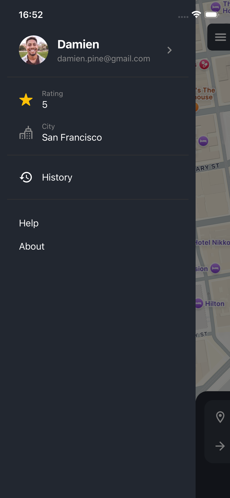
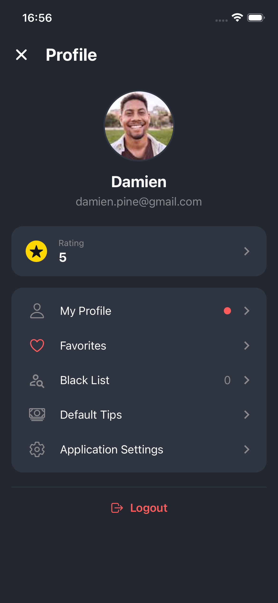
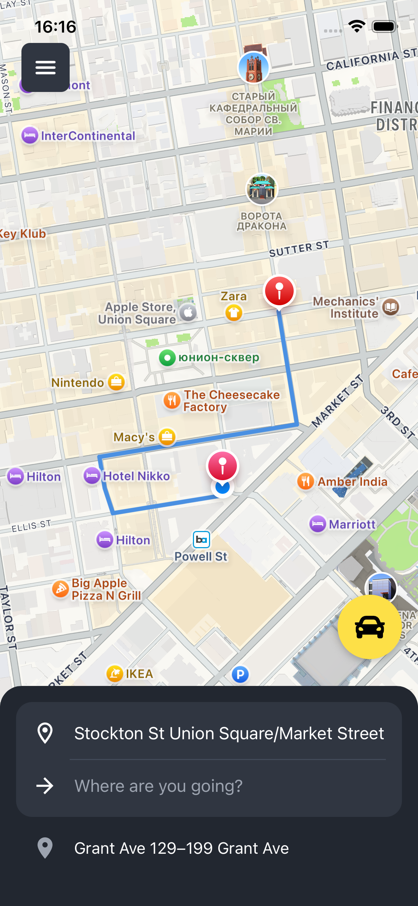
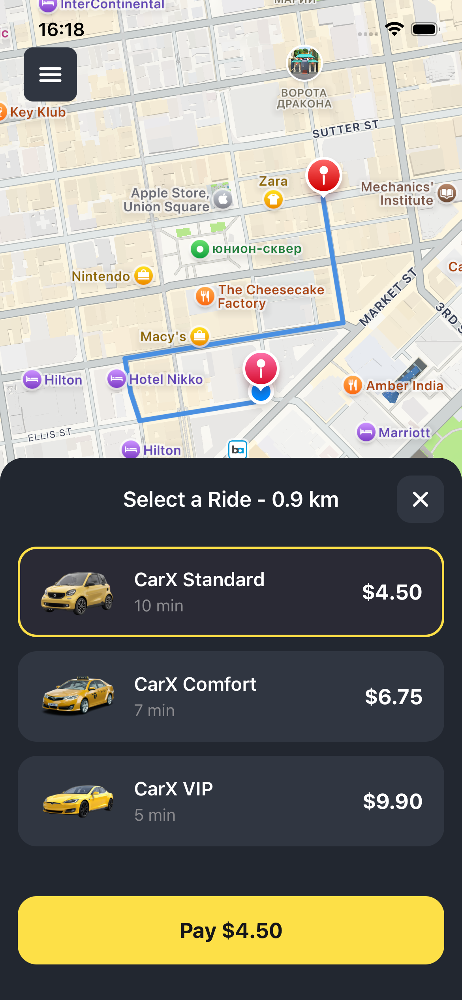

# CarX

CarX is a high-performance on-demand taxi booking application built with React Native and Expo. It provides a seamless experience for users to request rides, track drivers in real-time, and handle secure payments.
The project focuses on Offline-First architecture and a smooth, native-like UX, mimicking industry leaders like Uber or Lyft.

## Demo


## Features

- Real-time Geolocation: Interactive map integration with live route calculation and distance tracking.
- Ride Management: Complete flow from destination search to ride confirmation.
- Secure Payments: Full integration with Stripe API, including Apple Pay and saved card management.
- Smart Animations: Custom splash screens and smooth transitions powered by expo-image and react-native-reanimated.
- Backend Excellence: Powered by Firebase for real-time data syncing, authentication, and cloud storage.

## Run Locally

Clone the project

```bash
git clone https://github.com/19Vako/CarX.git
```

Go to the project directory

```bash
cd CarX
```

Install dependencies

```bash
npm install
```

Install Firebase functions dependencies

```bash
cd functions
npm install
cd ..
```

Start the app

```bash
npx expo start
```

## Architecture

This project is designed with a production-oriented architecture inspired by real-world ride-hailing systems.

- 📦 State Management Layer
  Redux Toolkit used for predictable state handling
  RTK Query manages server-state, caching, and API synchronization
  Separation between UI state and server state
- 🌐 Offline-First Approach
  Application is designed to remain functional under poor network conditions
  Local state caching for ride flow continuity
  Graceful recovery after reconnection
- 💳 Payments System (Stripe)
  Secure payment flow using Stripe SDK
  Supports Apple Pay and saved cards
  Payment state is decoupled from UI state to prevent inconsistencies
- 📍 Real-time Maps & Geolocation
  Google Maps integration via React Native Maps
  Live route calculation and polyline rendering
  Continuous location tracking for ride updates
- 🔥 Backend Architecture (Firebase)
  Firebase Auth for authentication flow
  Firestore for real-time ride and user data syncing
  Cloud Functions for server-side logic

## Testing

The project includes a structured testing setup focused on core business logic and state management.

### Unit Testing

- Redux slices (ride flow, UI state, modals)
- RTK Query logic and API layer behavior
- Utility functions for validation and formatting

### Mocking Strategy

- Mocked Redux store for isolated slice testing
- Mocked API responses for deterministic tests
- External UI libraries excluded from logic tests (focus on business logic)

### Integration Testing

- Ride creation flow (destination → route → confirmation)
- Payment initialization flow via Stripe
- Authentication state handling with Firebase

## Screenshots

 
